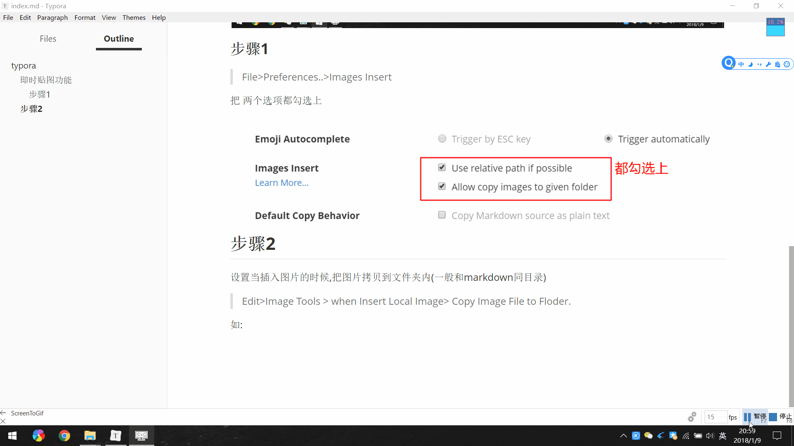
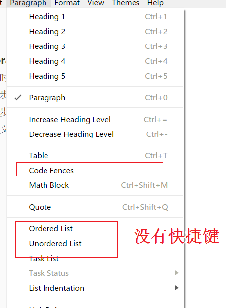
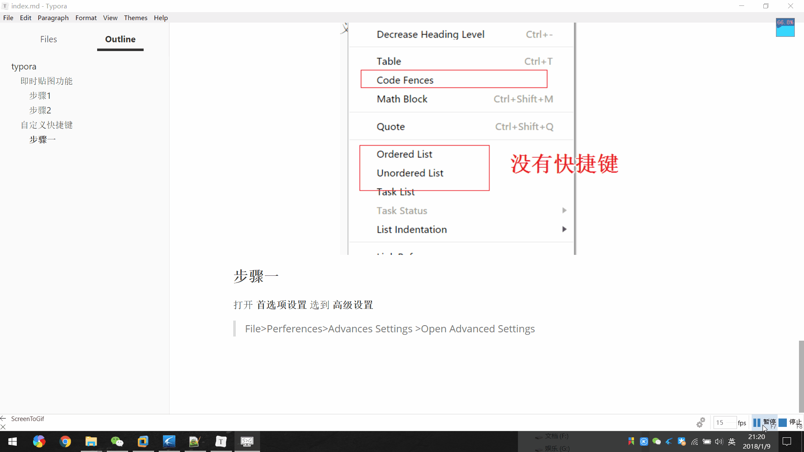
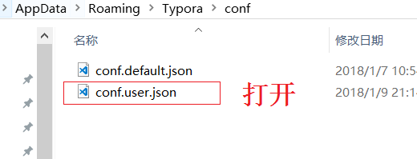
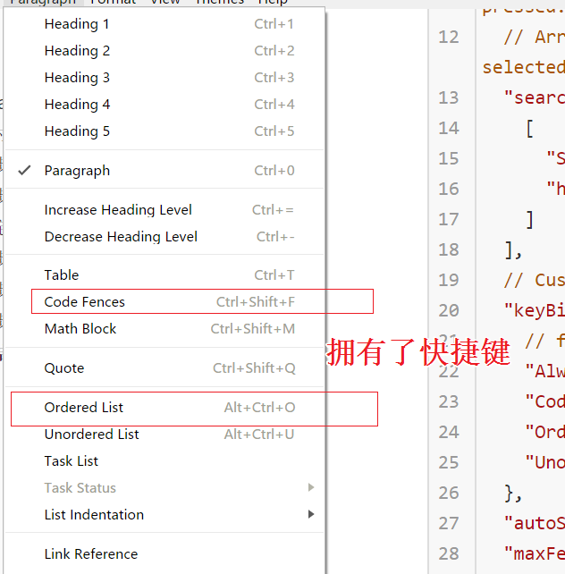

# typora 快捷键

http://support.typora.io/Shortcut-Keys/

### Autocomplete

on macOS, you could press `Esc` key to open inline preview for inline math, auto-complete for emoji, etc.

### File

| Function            | Hotkey (Windows/Linux) | Hotkey (macOS)      |
| ------------------- | ---------------------- | ------------------- |
| New                 | Ctrl + N               | Command + N         |
| New Window          | Ctrl + Shift + N       | Command +Shift + N  |
| New Tab             | *(Not Supported)*      | Command + T         |
| Open                | Ctrl + O               | Command + O         |
| Open Quickly        | Ctrl + P               | Command + Shift + O |
| Reopen Closed File  | Ctrl + Shift + T       | Command + Shift + T |
| Save                | Ctrl + S               | Command + S         |
| Save As / Duplicate | Ctrl + Shift + S       | Command + Shift + S |
| Preference          | Ctrl + ,               | Command + ,         |
| Close               | Ctrl + W               | Command + W         |

### Edit

| Function                                   | Hotkey (Windows/Linux)     | Hotkey (macOS)                      |
| ------------------------------------------ | -------------------------- | ----------------------------------- |
| New Paragraph                              | Enter                      | Enter                               |
| New Line                                   | Shift + Enter              | Shift + Enter                       |
| Cut                                        | Ctrl + X                   | Command + X                         |
| Copy                                       | Ctrl + C                   | Command + C                         |
| Paste                                      | Ctrl + V                   | Command + V                         |
| Copy As Markdown                           | Ctrl + Shift + C           | Command + Shift + C                 |
| Paste As Plain Text                        | Ctrl + Shift + V           | Command + Shift + V                 |
| Select All                                 | Ctrl + A                   | Command + A                         |
| Select Line/Sentence Select Row (in table) | Ctrl + L                   | Command + L                         |
| Delete Row (in table)                      | Ctrl + Shift + Backspace   | Command + Shift + Backspace         |
| Select Style Scope Select Cell (in table)  | Ctrl + E                   | Command + E                         |
| Select Word                                | Ctrl + D                   | Command + D                         |
| Delete Word                                | Ctrl + Shift + D           | Command + Shift + D                 |
| Jump to Top                                | Ctrl + Home                | Command + ↑                         |
| Jump to Selection                          | Ctrl + J                   | Command + J                         |
| Jump to Buttom                             | Ctrl + End                 | Command + ↓                         |
| Find                                       | Ctrl + F                   | Command + F                         |
| Find Next                                  | F3 / Enter                 | Command + G / Enter                 |
| Find Previous                              | Shift + F3 / Shift + Enter | Command + Shift + G / Shift + Enter |
| Replace                                    | Ctrl + H                   | Command + H                         |

### Paragraph

| Function               | Hotkey (Windows/Linux) | Hotkey (macOS)            |
| ---------------------- | ---------------------- | ------------------------- |
| Heading 1 to 6         | Ctrl + 1/2/3/4/5/6     | Command + 1/2/3/4/5/6     |
| Paragraph              | Ctrl + 0               | Command + 0               |
| Increase Heading Level | Ctrl + =               | Command + =               |
| Decrease Heading Level | Ctrl + -               | Command + -               |
| Table                  | Ctrl + T               | Command + Option + T      |
| Code Fences            | Ctrl + Shift + K       | Command + Option + C      |
| Math Block             | Ctrl + Shift + M       | Command + Option + B      |
| Quote                  | Ctrl + Shift + Q       | Command + Option + Q      |
| Ordered List           | Ctrl + Shift + [       | Command + Option + O      |
| Unordered List         | Ctrl + Shift + ]       | Command + Option + U      |
| Indent                 | Ctrl + [ / Tab         | Command + [ / Tab         |
| Outdent                | Ctrl + ] / Shift + Tab | Command + ] / Shift + Tab |

### Format

| Function     | Hotkey (Windows/Linux) | Hotkey (macOS)        |
| ------------ | ---------------------- | --------------------- |
| Strong       | Ctrl + B               | Command + B           |
| Emphasis     | Ctrl + I               | Command + I           |
| Underline    | Ctrl + U               | Command + U           |
| Code         | Ctrl + Shift + `       | Command + Shift + `   |
| Strike       | Alt + Shift + 5        | Control + Shift + `   |
| Hyperlink    | Ctrl + K               | Command + K           |
| Image        | Ctrl + Shift + I       | Command + Control + I |
| Clear Format | Ctrl + \               | Command + \           |

### View

| Function                        | Hotkey (Windows/Linux) | Hotkey (macOS)        |
| ------------------------------- | ---------------------- | --------------------- |
| Toggle Sidebar                  | Ctrl + Shift + L       | Command + Shift + L   |
| Outline                         | Ctrl + Shift + 1       | Command + Control + 1 |
| Articles                        | Ctrl + Shift + 2       | Command + Control + 2 |
| File Tree                       | Ctrl + Shift + 3       | Command + Control + 3 |
| Source Code Mode                | Ctrl + /               | Command + /           |
| Fouus Mode                      | F8                     | F8                    |
| Typewriter Mode                 | F9                     | F9                    |
| Toggler Fullscreen              | F11                    | Command + Option + F  |
| Actual Size                     | Ctrl + Shift + 0       | *(Not Supported)*     |
| Zoom In                         | Ctrl + Shift + =       | *(Not Supported)*     |
| Zoom Out                        | Ctrl + Shift + -       | *(Not Supported)*     |
| Switch Between Opened Documnets | Ctrl + Tab             | Command + `           |
| Toggle DevTools                 | Ctrl + Shift + I       | -                     |

# 让 typora和word一样好用

typora是一款支持实时预览的markdown编辑器,作者在使用过其他几款的编辑器里面,发现typora的确实简单使用,而且功能强大.尤其是经过一些简单设置后,可以做到像word一样简单使用.

## 即时贴图功能

使用markdown做笔记的人应该知道,很多编辑器是不提供将粘贴图 贴到markdown中的.因为这个体验,所以很多人在处理一些带图片的文档的时候,还是宁愿使用word.现在可以分享给大家将typora设置一番后,就可以将粘贴板的图片直接贴到markdown中.如


### 步骤1 

> File>Preferences..>Images Insert  

把 两个选项都勾选上 


### 步骤2

设置当插入图片的时候,把图片拷贝到文件夹内(一般和markdown同目录)

> Edit>Image Tools > when Insert Local Image> Copy Image File to Floder.

如:



此时,拷贝你的粘贴板的图片到markdown中试试

注意,也可以直接将本地的图片拖放到markdown中.

## 自定义快捷键

由于typora有一些文字格式是没有快捷键的,所以需要实现自定义快捷键功能.如 **插入代码段 有序无序列表**  等

对于习惯使用快捷键的人来说,每次都需要手动点击的话,是很麻烦的.所以,需要自己实现快捷键的设置.



### 步骤一

打开 **首选项设置** 选到 **高级设置**

> File>Perferences>Advances Settings >Open Advanced Settings



### 步骤2

此时 打开 用户配置文件  **conf.user.json**



### 步骤3

将如下文本,全部替换即可

```json
/** For advanced users. */
{
  "width": null, // Integer - Window's width in pixels. Default is null (last window width)
  "height": null, // Integer - Window's height in pixels. Default is null (last window height)
  "defaultFontFamily": {
    "standard": null, //String - Defaults to "Times New Roman".
    "serif": null, // String - Defaults to "Times New Roman".
    "sansSerif": null, // String - Defaults to "Arial".
    "monospace": null // String - Defaults to "Courier New".
  },
  "autoHideMenuBar": false, //Boolean - Auto hide the menu bar unless the `Alt` key is pressed. Default is false.
  // Array - Search Service user can access from context menu after a range of text is selected. Each item is formatted as [caption, url]
  "searchService": [
    [
      "Search with Google",
      "https://google.com/search?q=%s"
    ]
  ],
  // Custom key binding, which will override the default ones.
  "keyBinding": {
    // for example: 
    "Always On Top": "Ctrl+Shift+P",
    "Code Fences": "Ctrl+Shift+F",
    "Ordered List": "Ctrl+Alt+o",
    "Unordered List": "Ctrl+Alt+u"
  },
  "autoSaveTimer": 5, // default 5 minutes
  "maxFetchCountOnFileList": 500
}
```

### 结果演示



### 附:

细心的同学可能发现了,作者把typora改成英文版也就是为了以后添加快捷键方便

#### 修改语言方式


